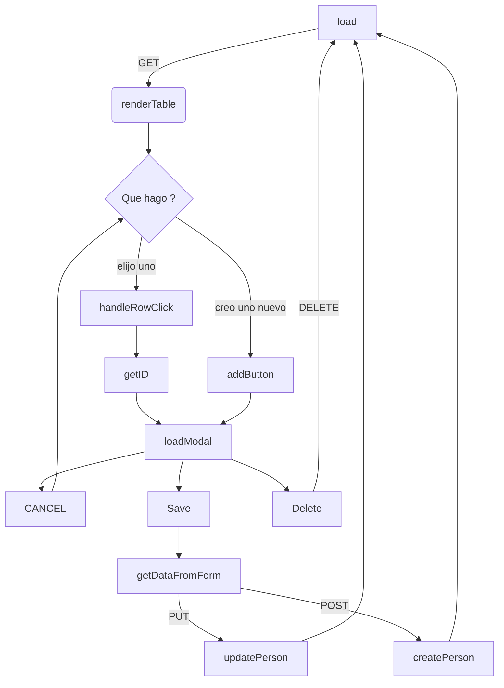

# Ejercicio Crud/Frontend

### UML:
#### Diagrama de Clases:

%20clase2023-05-30/UI%20Example.png)

```mermaid
flowchart 
    A[load] -->|GET| AAB(renderTable)
    AAB --> AAC{Que hago ?}
    AAC -->|elijo uno| B
    AAC -->|creo uno nuevo| BB
    
    B[handleRowClick] -->BA[getID]
    BA --> C[loadModal]

    BB[addButton] --> C[loadModal]

    C --> CC[CANCEL]
        CC-->AAC
    C --> CA[Save]
    C --> CB[Delete]
        CB -->|DELETE| A
    
    CA --> CAB[getDataFromForm]
    CAB -->|PUT| D[updatePerson]
    CAB -->|POST| E[createPerson]
        D --> A
        E --> A
```

<!--PARA EDITAR MARKDOWN FILES:  https://stackedit.io/app# -->
